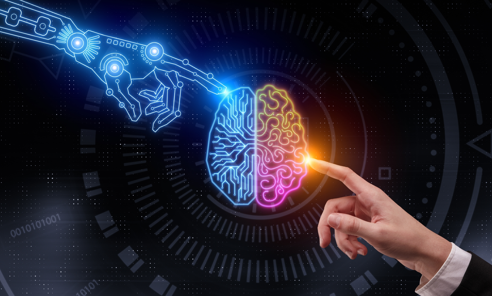
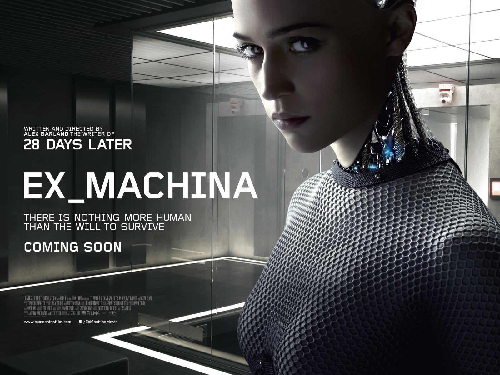
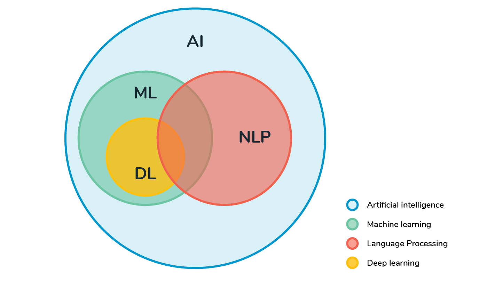

```{r setup, include=FALSE}
knitr::opts_chunk$set(echo = FALSE)
```

# **Motivación e introducción**

## **¿Qué es la inteligencia artificial (IA)?**

```{r, echo=FALSE, out.width="90%", fig.align="center"}

```

## Inteligencia Artificial

Acorde a @Russell2005:

*''Nos llamamos a nosotros mismos Homo sapiens - hombre sabio - porque nuestra inteligencia es muy importante para nosotros. Por miles de años hemos intentado entender cómo pensamos; es decir, cómo un mero puñado de masa puede percibir, entender, predecir y manipular un mundo mucho más grande y complicado que sí mismo. El campo de la inteligencia artificial, o IA, va más allá: intenta no solo entender sino también construir entes inteligentes.''* (traducido del inglés).

## La prueba de Turing

¡Dale clic a la imagen!

```{r, echo=FALSE, out.width="70%", fig.align="center", fig.link="http://www.youtube.com/watch?feature=player_embedded&v=5G2h9fSc-5Q"}

```

## Descripción de la prueba de Turing (1)

+ Desarrollada por Alan Turing en 1950, fue diseñada para proporcionar un definición operativa satisfactoria de inteligencia [@Russell2005].
+ La computadora necesita tener las siguientes habilidades para pasar la prueba, sin necesidad de interacción física:
  + **Procesamiento del lenguaje natural** para poder comunicarse exitosamente.
  + **Representación del conocimiento** para almacenar lo que escuche o conozca.
  + **Razonamiento automático** para usar la información almacenada al responder preguntas y obtener nuevas conclusiones.
  + **Aprendizaje automático (o de máquina)** para adaptarse a nuevas circunstancias, y detectar y extrapolar patrones.
  
## Descripción de la prueba de Turing (2)

+ Al incluir la interacción física, para que la máquina pase una prueba completa de Turing se necesita:
  + **Visión por computadora** para percibir objetos.
  + **Robótica** para manipular objetos y moverse.
  
## **¿Qué es el procesamiento del lenguaje natural (PLN)?**

```{r, echo=FALSE, out.width="90%", fig.align="center"}

```

## Procesamiento del lenguaje natural

Según @Sarkar2019:

*''El PLN se define como un campo especializado de las ciencias de la computación, la ingeniería y la inteligencia artificial enraizado en la lingüística computacional. Este está principalmente enfocado en el diseño y construcción de aplicaciones y sistemas que permitan la interacción entre máquinas y lenguajes naturales utilizados por el ser humano... Las técnicas de PLN permiten que las computadoras procesen y entiendan el lenguaje natural humano y lo utilicen para dar resultados útiles.''* (traducido del inglés).

## **¿Cuál es la relación entre la IA y el PLN?**

```{r, echo=FALSE, out.width="90%", fig.align="center"}

```

## Relación entre la IA y el PLN

@Sarkar2019 menciona:

*''El procesamiento del lenguaje natural siempre ha captado mi atención debido a que el cerebro humano y nuestras habilidades cognitivas son realmente fascinantes. La habilidad para comunicar información, pensamientos complejos y emociones con tan poco esfuerzo es asombrosa una vez que piensas en cómo replicarla en las máquinas. Es un hecho que estamos avanzando por saltos y con límites en lo que se refiere a la computación cognitiva y la inteligencia artificial, pero aún no llegamos a la meta. Tal vez el pasar la prueba de Turing no es suficiente ¿Puede una máquina en realidad replicar al humano en todos sus aspectos?''* (traducido del inglés).

# **Aplicaciones del PLN**

## Referencias