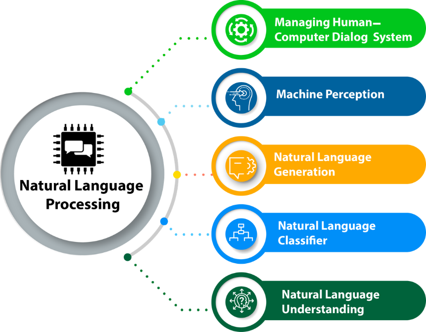
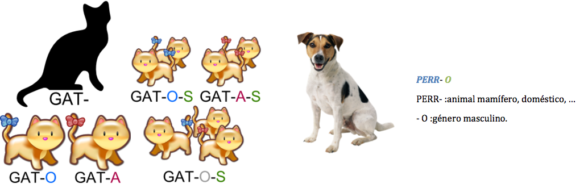
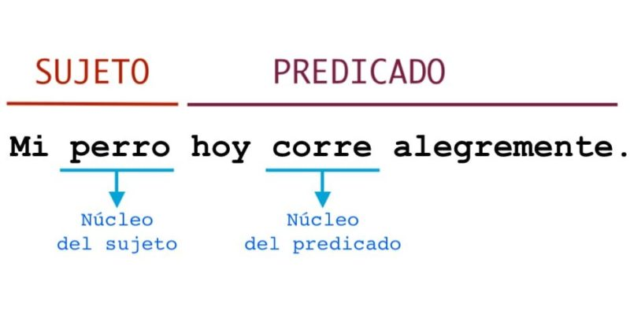
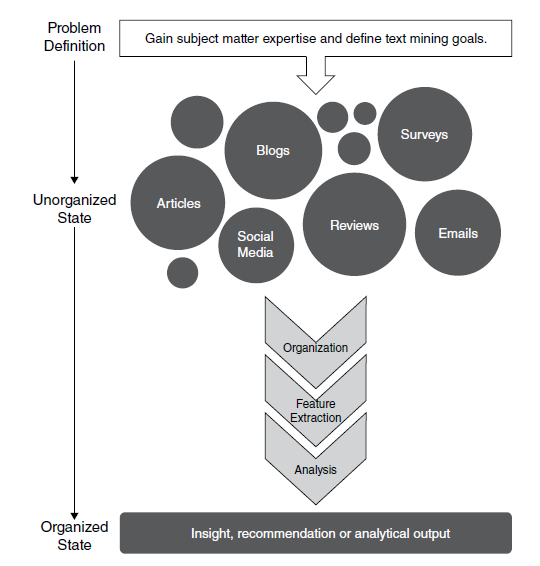
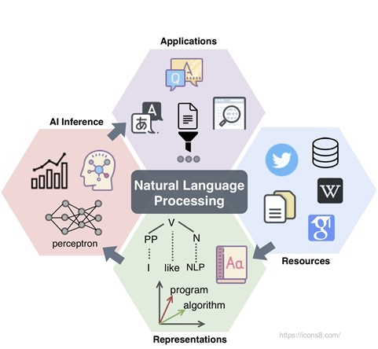

```{r setup, include=FALSE}
knitr::opts_chunk$set(echo = TRUE)
```

\newpage

```{r, echo=FALSE, out.width="100%", fig.align="center"}
knitr::include_graphics("../../../figuras/TallerXSeminarioSEE.jpg")
```

# 1. Motivación e introducción

## ¿Qué es la inteligencia artificial (IA)?

```{r, echo=FALSE, out.width="90%", fig.align="center"}
knitr::include_graphics("../../../figuras/IA.jpg")
```

## 

Acorde a @Russell2005:

*''Nos llamamos a nosotros mismos Homo sapiens - hombre sabio - porque nuestra inteligencia es muy importante para nosotros. Por miles de años hemos intentado entender cómo pensamos; es decir, cómo un mero puñado de masa puede percibir, entender, predecir y manipular un mundo mucho más grande y complicado que sí mismo. El campo de la inteligencia artificial, o IA, va más allá: intenta no solo entender sino también construir entes inteligentes.''* (traducido del inglés). 

## ¿Qué es el procesamiento del lenguaje natural (PLN)?

```{r, echo=FALSE, out.width="90%", fig.align="center"}

```

## 

Según @Sarkar2019:

*''El PLN es un campo especializado de las ciencias de la computación, la ingeniería y la inteligencia artificial enraizado en la lingüística computacional. Este está principalmente enfocado en el diseño y construcción de aplicaciones y sistemas que permitan la interacción entre máquinas y lenguajes naturales utilizados por el ser humano... Las técnicas de PLN permiten que las computadoras procesen y entiendan el lenguaje natural humano y lo utilicen para dar resultados útiles.''* (traducido del inglés).

# 2. Aplicaciones del PLN

##

```{r, echo=FALSE, out.width="90%", fig.align="center"}

```

## Top de aplicaciones del PLN

Acor a @Abhishek2020 y @Villalonga2019 sugieren que el top de aplicaciones prácticas del PLN son:

+ Chatbots y asistentes por voz (agentes conversacionales)
+ Traductores automáticos
+ Monitoreo de redes sociales
+ Detección de noticias falsas
+ Análisis de encuestas
+ Publicidad enfocada
+ Contratación y reclutamiento
+ Revisores de gramática:
+ Filtrado de correo electrónico
+ Búsqueda de respuestas

# 3. Lenguajes naturales

##

```{r, echo=FALSE, out.width="90%", fig.align="center"}

```

## ¿Qué es un lenguaje natural?

Para @Sarkar2019:

*''El lenguaje natural es un lenguaje desarrollado y evolucionado por los humanos a través del uso y comunicación "natural" (distinto a un lenguaje de programación). Tal lenguaje puede ser expresado de manera escrita, verbal o incluso mediante señas.''*

## Conocimiento del lenguaje usado en PLN

Acorde a @Villalonga2019, para el procesamiento del lenguaje natural se requiere del conocimiento de las siguientes áreas:

+ La **fonética** y la **fonología** se relacionan al conocimiento sobre los sonidos linguísticos.
+ La **morfología** es el conocimiento de los componentes significativos de las palabras. Esta nos sirve por ejemplo, para identificar que ''puertas'' es el plural de ''puerta''.
+ La **sintaxis** es la parte de la gramática que estudia el modo en que se combinan las palabras y los grupos que estas forman para expresar significados, así como las relaciones que se establecen entre todas esas unidades.

##

+ La **semántica** es el conocimiento del significado. Esta se aplica por ejemplo, para entender el significado de palabras aisladas o en conjunto, y de saber que dicho significado puede variar en distintos escenarios.
+ La **pragmática** es el conocimiento de la relación del significado con los objetivos y las intenciones. Es decir, nos sirve para saber el tipo de expresión que alguien ha utilizado.
+ El **discurso** es el conocimiento sobre unidades lingüísticas más grandes que un solo enunciado. Esto es útil para resolver referencias cruzadas por ejemplo.

# 4. Morfología, morfosintaxis, sintaxis y semántica en el PLN

## Morfología

```{r, echo=FALSE, out.width="90%", fig.align="center"}

```

## Morfología en el procesamiento del lenguaje natural

+ La **morfología computacional** trata de reconocer de forma automática los morfemas que contiene una palabra. Esta es importante para reconocer palabras como ‘pensar’ y ‘piénsalo’ como una sola, además de reconocer el género y número de un nombre para encajarlo con un adjetivo por ejemplo.
+ En el **análisis morfológico** automático se obtiene como salida la raíz de las palabras (lema) y la información gramatical que aportan los diferentes morfemas, a lo que se llama características morfológicas.
  + **Ejemplo:** 'Cantábamos' tiene 3 morfemas: ‘cant’ (cantar), ‘-aba’ (pasado) y ‘-mos’ (plural).

## Morfosintaxis

```{r, echo=FALSE, out.width="90%", fig.align="center"}

```

## Morfosintaxis en el procesamiento del lenguaje natural

+ El **etiquetado morfosintáctico** es el proceso de identificar las distintas partes de la oración y consiste en asignar una etiqueta (tag) sobre la categoría gramatical a cada una de las palabras de un texto de entrada.
+ La **entrada del algoritmo** es una secuencia de palabras y la salida es una secuencia de pares formados por la palabra y la correspondiente etiqueta indicando su categoría gramatical.
+ El etiquetado morfosintáctico realiza durante su funcionamiento un proceso de **desambiguación** donde reconoce correctamente la etiqueta de una palabra que puede pertenecer a más de una categoría gramatical.
+ Una de las técnicas más usuales de etiquetado morfosintácticos son los **modelos ocultos de Markov (HMM)**. 
+ Veamos un recurso online para afianzar nuestras ideas: [Analizador morfosintáctico Linguakit](https://linguakit.com/es/etiquetador-morfosintactico).

## Sintaxis

```{r, echo=FALSE, out.width="90%", fig.align="center"}

```

## Sintaxis en el procesamiento del lenguaje natural

+ Los **analizadores sintácticos** suelen basarse en **programación dinámica** y **métodos probabilistas**. Uno de los algoritmos más comunes es el **algoritmo CKY probabilístico**.
+ Estos suelen enfrentar el problema de la **ambigüedad estructural**. Esta se debe a las múltiples reglas representadas en una gramática que provienen del uso común de una lengua y que permiten que se pueda encontrar **varios resultados del análisis sintáctico** que se ajuste correctamente a una frase analizada. 
+ Al final la **selección del resultado final** se realiza normalmente a través de procesos de **desambiguación sintáctica** que requieren fuentes de conocimiento **estadístico**, **semántico** y **contextual**. 
+ Afiancemos nuestras ideas con un recurso online: [Analizador sintáctico Linguakit](https://linguakit.com/es/analizador-sintactico).

## Semántica

```{r, echo=FALSE, out.width="90%", fig.align="center"}

```

## Semántica en el procesamiento del lenguaje natural

+ La **creación automática** de una representación rigurosa del significado de la oración requiere de **múltiples fuentes de conocimiento y técnicas de inferencia**. 
+ La **representación formal** del significado debe ser verificable, inequívoca, expresiva y permitir la inferencia de nuevo conocimiento.
+ La mayoría de los modelos que se utilizan para representar el significado tienen en común la capacidad para representar objetos, sus propiedades y las relaciones entre estos.
+ Lo que se suele hacer es **integrar el conocimiento semántico en el análisis sintáctico**.

# 5. Principios básicos del análisis de datos texto

## Análisis de datos de texto

```{r, echo=FALSE, out.width="90%", fig.align="center"}
knitr::include_graphics("../../../figuras/TextMining.jpg")
```

## ¿Qué es el análisis de texto y cuáles son sus ventajas?

Según @Kwartler2017:

+ El análisis de datos de texto es el proceso de destilar accionables útiles desde texto.
+ Realizado sobre R (o cualquier lenguaje de programación similar), este análisis tiene varias ventajas, incluyendo (y no limitado) a las siguientes:
  + Crea confianza en los involucrados en cada proyecto.
  + Se puedan aplicar varias metodologías de manera rápida.
  + Los procedimientos realizados son de naturaleza auditable y reproducible.
  + Obtiene datos novedosos del texto.

## Flujo de trabajo sobre datos de texto

+ Los datos de texto son de naturaleza no estructurada. 
+ Estos deben ser primero pre-procesados de una manera estructurada, se deben definir sus características y luego ser extraídas en forma de un documento organizado conocido como corpus.
+ Al final se analizan las características extraídas.

##

```{r, echo=FALSE, out.width="70%", fig.align="center"}

```

##

A breves rasgos, podemos seguir estos pasos:

1. Definir el problema y los objetivos específicos
2. Identificar los datos de texto que deben ser recolectados
3. Organizar el texto
4. Extraer características
5. Análisis
6. Elaborar las conclusiones y/o recomendaciones

##

```{r, echo=FALSE, out.width="70%", fig.align="center"}

```

# 6. Tipos de análisis de texto

## Bolsa de palabras (bag of words)

+ El mineo de texto basado en bolsa de palabras es más fácil de entender y analizar, incluso para el uso de técnicas de aprendizaje automático.

+ Este trata cada palabra (o grupo de palabras, i.e. n-gramas) como una característica única de un documento. En este tipo de análisis el orden de las palabras y sus características gramáticas y sintácticas no son utilizadas.

+ Uno de sus principales beneficios yace en que sus técnicas no son computacionalmente costosas, y por ende el análisis puede ser realizado de manera rápida. Debido a que sus resultados son devueltos en forma de datos estructurados, estos pueden ser utilizados en modelos de aprendizaje automático.

+ Los datos pueden ser analizados en formato **tidy** o como **matrices documento término**. 

## Análisis sintáctico (syntactical parsing)

+ El análisis sintáctico difiere de una bolsa de palabras tanto en complejidad como en enfoque.

+ Este se basa en la sintaxis de las palabras y utiliza el etiquetado POS (part of speech) para identificar las palabras en un contexto adecuado. Cada una de las etiquetas es analizada para obtener conclusiones y resultados.

# 5. Ejercicio: 'Haremos un caso de análisis que nadie podrá rechazar'

##

[¡Da clic aquí antes de que el script acabe durmiendo con los peces!](https://github.com/sXHugoXe/CursoPLNconR/blob/main/talleres/TallerXSeminarioSEE/scripts/dia1_ProcesamientoVisualizacion.R)

```{r, echo=FALSE, out.width="90%", fig.align="center"}

```

+ [Link a los datos, por si quieres ir preparado.](https://github.com/sXHugoXe/CursoPLNconR/tree/main/recursos/el_padrino.epub)

## Referencias