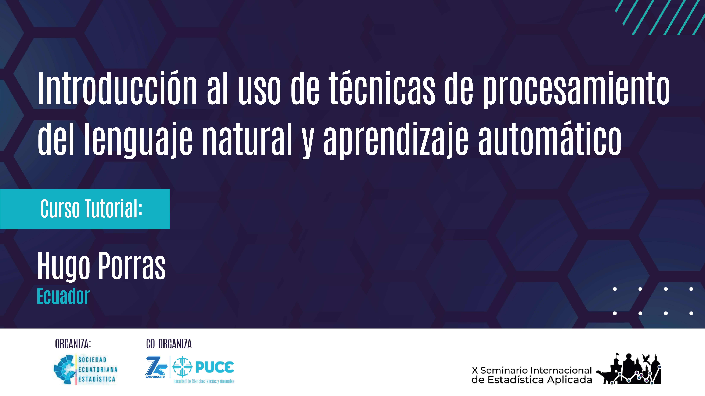
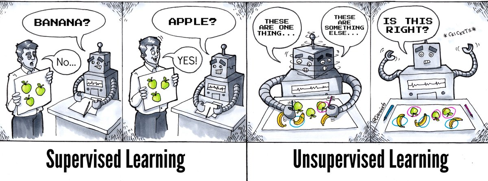
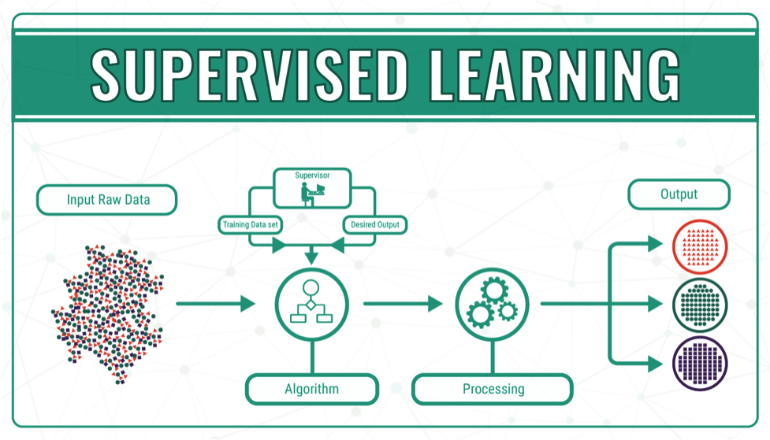
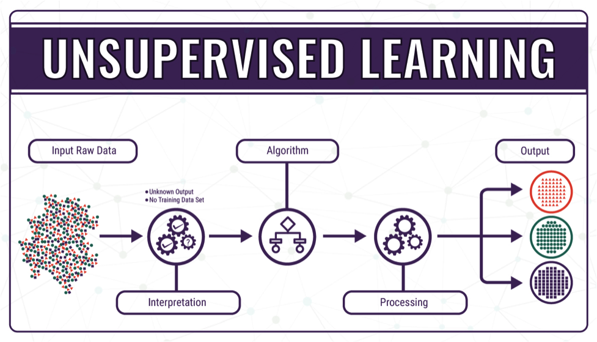
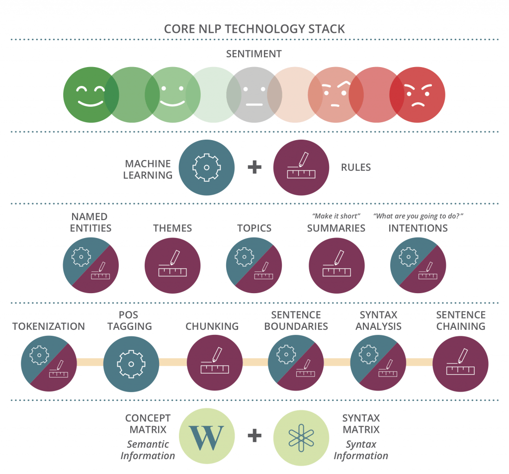

```{r setup, include=FALSE}
knitr::opts_chunk$set(echo = TRUE)
```

\newpage

```{r, echo=FALSE, out.width="100%", fig.align="center"}

```

# Motivación e introducción

## ¿Qué es el aprendizaje automático?

```{r, echo=FALSE, out.width="90%", fig.align="center"}

```

## 

Acorde a @GironesRoig2017:

*"La inteligencia artificial, sustentada de lleno en las matemáticas y la computación, plantea a analistas, programadores e ingenieros el reto del aprendizaje continuo e incansable que persigue un conocimiento inalcanzable y palpable a la vez. Si las ciencias exactas son el mejor idioma de que disponemos para hablar con el universo, también son la mejor herramienta que tenemos para tratar de imitar la inteligencia humana."*

##

El aprendizaje automático (o de máquina), como parte de la inteligencia artificial, es la ciencia (o arte) de programar las computadoras para que éstas puedan aprender de los datos. Es decir, le damos la habilidad a la computadora de aprender sin ser explícitamente programada.

De una manera más objetiva, Abu-Mostafa, profesor del curso de [CALTECH: Learning from Data](http://work.caltech.edu/telecourse.html), menciona que la esencia del aprendizaje automático yace sobre 3 puntos:

-   Existe un patrón en algún fenómeno.

-   No podemos especificar dicho patrón de manera exacta a través de una formalización matemática.

-   Tenemos datos.

## Tareas y usos del aprendizaje automático

```{r, echo=FALSE, out.width="90%", fig.align="center"}

```

## 

Con las anteriores premisas, las tareas de aprendizaje automático incluyen varias situaciones, incluyendo (pero no limitándose):

-   **Predecir:** nivel de ventas en base a gasto en publicidad.

-   **Clasificar:** clientes buenos y malos según su comportamiento al pagar un crédito.

-   **Descubrir patrones:** tipos de clientes según sus características sociodemográficas y de consumo.

-   **Realizar inferencia:** sobre variables que en teoría tienen efecto sobre un fenómeno.

# Tipos de aprendizaje

##

```{r, echo=FALSE, out.width="90%", fig.align="center"}

```

## Aprendizaje supervisado

```{r, echo=FALSE, out.width="90%", fig.align="center"}

```

##

En el aprendizaje supervisado tenemos una variable dependiente (output) continua o categórica, y queremos predecirla con un conjunto disponible de variables explicativas (input). Dentro de él existen dos tipos de problemas:

+ **Problemas de clasificación:** Tenemos como variable dependiente una del tipo categórica (i.e. con dos o más clases) que buscamos predecir.
+ **Problema de regresión:** Tenemos como variable dependiente una del tipo continua (i.e. numérica) que buscamos predecir.

## Aprendizaje no supervisado

```{r, echo=FALSE, out.width="90%", fig.align="center"}

```

##

En el aprendizaje no supervisado tenemos un conjunto variable continuas o categóricas sobre las cuales deseamos aprender o descrubrir un patrón de comportamiento. Tales patrones pueden ser descubiertos a través de técnicas de reducción de dimensionalidad o técnicas de agrupamiento, las cuales son definidas brevemente a continuación.

##

+ **Reducción de dimensionalidad:** Los métodos de reducción de dimensionalidad consisten en resumir y visualizar la información más importante contenida en un dataset. Existen varias técnicas alrededor de esta temática, tanto si asumimos que existen patrones lineales como no lineales en los datos.

+ **Clustering:** Las técnicas de agrupamiento o clustering nos permiten obtener conocimiento a partir del descubrimiento de patrones existentes en los datos. Específicamente, el objetivo de los métodos de clustering yacen en la identificación de grupos de objetos similares en un conjunto de datos de interés a través de una medida de similaridad entre puntos (e.g la distancia euclideana).

# El aprendizaje automático dentro del PLN

##

```{r, echo=FALSE, out.width="60%", fig.align="center"}

```

## Tareas del PLN que pueden ser resueltas con AA

El PLN puede ser combinado con el aprendizaje automático en varias tareas, sean estas específicas al campo o no. Estas incluyen (pero no se limitan):

-   Etiquetado morfosintáctico
-   Análisis sintáctico
-   Análisis de sentimientos
-   Desambiguación de palabras
-   Clasificación de textos
-   Predicción del precio de las acciones
-   Agrupamiento de temáticas
-   Predicción de texto
-   Detección de noticias falsas, etc.

# Ejercicio: '¿Y si descubrimos los temas secretos de las reuniones de las cinco familias?'

##

[¡Da clic aquí antes de que el script acabe durmiendo con los peces!](https://github.com/sXHugoXe/CursoPLNconR/blob/main/talleres/TallerXSeminarioSEE/scripts/dia2_AprendizajeAutomatico.R)

```{r, echo=FALSE, out.width="90%", fig.align="center"}

```

+ [Link a los datos que preparamos ayer ¡Pero escóndelos bien!](https://github.com/sXHugoXe/CursoPLNconR/blob/main/talleres/TallerXSeminarioSEE/prepared/padrino_annotated.RDS)

## Referencias